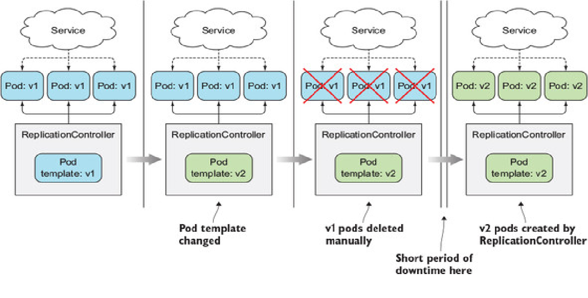
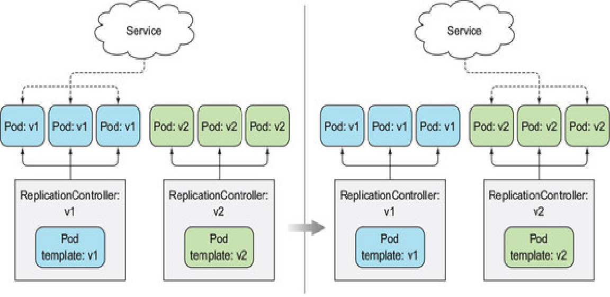
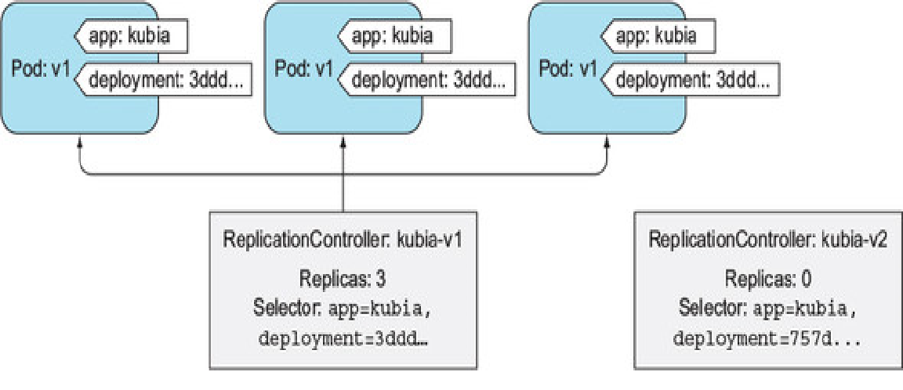
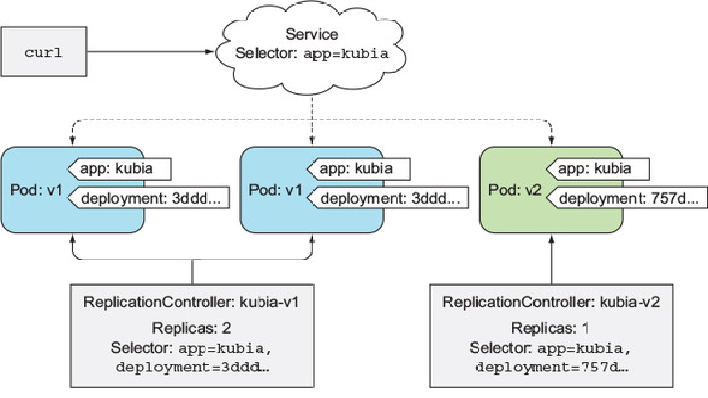
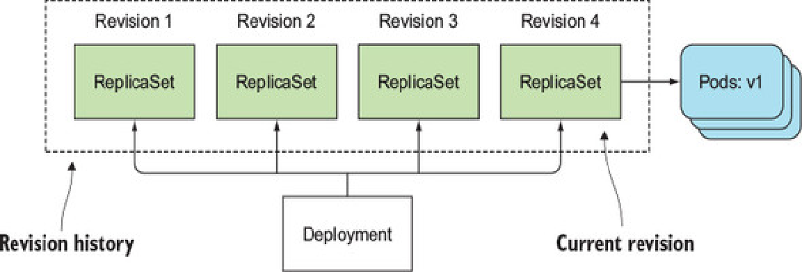

# Introducción
Un despliegue tipo tendra:  
- Un Resorce Controller o un Replica Set que gobierna una serie de Pods  
- Un servicio que apunta a los Pods, ofreciendo un balenceador para acceder a ellos  
- Pods ejecutando nuestra aplicación  

Cuando necesitamos desplegar una nueva versión de los Pods, tenemos varias opciones:  
- ___Big-Bang___. Cambiar el spec del Pod apuntado a la nueva versión de la imagen; Matar los Pods; El RC reconstruirá los Pods, esta vez con la nueva versión de las imagenes.  


- ___Blue-Green___. Crear un nuevo Pod con la nueva versión de las imagenes, pero con una etiqueta diferente al Pod que queremos reemplazar; El nuevo Pod estara governado por un nuevo Resource Controller; El nuevo Resource Controller arrancara todos lo nuevos Pods; Cuando esten todos arrancados modificar el servicio para que use la nueva etiqueta; Matar l viejo Resource Controller - y Pods.  



Con la primera opción, que puede ejecutarse de distintas formas (borrar todos, crear todos; Borrar uno a uno), podemos tener perdida de servicio. Con la segunda opción tendremos dos versiones de la aplicación dando servicio simultáneo a los clientes - puede haber casos en los que esto no sea soportado por la aplicación -  y una sobre-alocación de recursos.  

Una opción intermedia en el sentido de que no se pierde el servicio sería hacer un ___Rolling-update___. En este caso se van introduciendo progresivamente los nuevos Pods - el servicio apunta a las dos etiquetas -. Progresivamente significa que el número de instancias obejetivo entre los dos Resource Controllers es el total de instancias que deseamos ejecutar, pero progresivamente el total de instancias en el "viejo" RC se reduce en la misma medida que se aumentan en el "nuevo" RC.  


## Image Tag
Si el cambio en la aplicación que hemos descrito antes lo publicamos en una imagen que tiene el mismo ``tag`` que la imagen que estamos reemplazando, Kubernetes por defecto no identificara que la imagen a cambiado. Esto significa que siempre que Kubernetes schedule una Pod en un nodo en el que ya estuviera la imagen descargada - por ejemplo porque ya hubiera Pods corriendo con esa imagen en el nodo -, no se tomara la imagen actualizada. SI queremos que siempre se descargue una copia fresca de la imagen debemos setear la propiedad __imagePullPolicy__ del contenedor a ``Always``. El otro valor admisible para esta propiedad es ``IfNotPresent``.  

La política por defecto dependerá de como nos estemos refiriendo a la imagen en el contenedor. Si no especificamos tag, o usamos latest, la política por defecto será ``Always``, de lo contrario, ``IfNotPresent``.  

# Rolling update Automático
## Ejemplo
Supongamos la siguiente aplicación nodejs:  
```
const http = require('http');
const os = require('os');

console.log("Kubia server starting...");

var handler = function(request, response) {
  console.log("Received request from " + request.connection.remoteAddress);
  response.writeHead(200);
  response.end("This is v1 running in pod " + os.hostname() + "/n");
};

var www = http.createServer(handler);
www.listen(8080);
```
Definimos un RC. El RC incluye la spec del Pod que debe crearse, que tiene como etiqueta ``app: kubia``:  
```
apiVersion: v1
kind: ReplicationController
metadata:
  name: kubia-v1
spec:
  replicas: 3
  template:
    metadata:
      name: kubia
      labels:                      
        app: kubia                 
    spec:
      containers:
      - image: luksa/kubia:v1      
        name: nodejs
---                                
```
Definimos el Servicio con ``selector`` que apunta al contenedor gestionado por el RC, ``app: kubia``. El servicio es de tipo ````, de modo que sera accesible desde fuera del cluster con una IP pública:  
```
apiVersion: v1
kind: Service
metadata:
  name: kubia
spec:
  type: LoadBalancer
  selector:                        
    app: kubia                     
  ports:
  - port: 80
    targetPort: 8080
```
Una vez creados estos recursos podemoc comprobar que servicios estan operativos:  
```
kubectl get svc kubia

NAME      CLUSTER-IP     EXTERNAL-IP       PORT(S)         AGE
kubia     10.3.246.195   130.211.109.222   80:32143/TCP    5m
```
Y podriamos comprobar que la aplicación esta operativa en la IP ``130.211.109.222``:  
```
# while true; do curl http://130.211.109.222; done

This is v1 running in pod kubia-v1-qr192
This is v1 running in pod kubia-v1-kbtsk
This is v1 running in pod kubia-v1-qr192
This is v1 running in pod kubia-v1-2321o
(...)
```
Si ahora quisieramos cambiar la versión de la aplicación - nodejs - para introducir el siguiente cambio:  
```
response.end("This is v2 running in pod " + os.hostname() + "/n");
```

Para hacer este despligue en modo Rolling Update de forma automática, hay un comando específico:  
```
kubectl rolling-update kubia-v1 kubia-v2 --image=luksa/kubia:v2

Created kubia-v2
Scaling up kubia-v2 from 0 to 3, scaling down kubia-v1 from 3 to 0 (keep 3
     pods available, don't exceed 4 pods)

```
Los argumentos son el nombre del RC "viejo", el nombre del RC "nuevo", y la imagen que debe introducirse en los nuevos Pods. Inicialmente tendremos la siguiente foto:  


En este __instante__ la definición del RC será:  
```
kubectl describe rc kubia-v2

Name:       kubia-v2
Namespace:  default
Image(s):   luksa/kubia:v2                                           
Selector:   app=kubia,deployment=757d16a0f02f6a5c387f2b5edb62b155
Labels:     app=kubia
Replicas:   0 current / 0 desired                                    
(...)
```
Nos podemos fijar que además del selector que habiamos indicado en la spec, Kubernetes __ha creado un nuevo selector__. No solo eso, en el "viejo" RC Kubernetes también ha añadido un nuevo selector:  
```
kubectl describe rc kubia-v1
Name:       kubia-v1
Namespace:  default
Image(s):   luksa/kubia:v1
Selector:   app=kubia,deployment=3ddd307978b502a5b975ed4045ae4964-orig
```
Esta cambio en el "viejo" RC viene acompañado también con un cambio en los Pods (lógicamente, porque de lo contrario el RC tendría cero Pods asociados, y los trataría de crear!!!):  
```
kubectl get po --show-labels

NAME            READY  STATUS   RESTARTS  AGE  LABELS
kubia-v1-m33mv  1/1    Running  0         2m   app=kubia,deployment=3ddd...
kubia-v1-nmzw9  1/1    Running  0         2m   app=kubia,deployment=3ddd...
kubia-v1-cdtey  1/1    Running  0         2m   app=kubia,deployment=3ddd...
```
De esta forma el "nuevo" RC no apunta a los Pods porque no tiene la nueva etiqueta, mientras que el "viejo" RC sigue apuntando a los Pods:  


Todo esto sucede antes de que haya empezado el proceso de escalado. A continuación Kubernetes incrementara el escalado en el nuevo RC en uno, y lo disminuira en uno en el viejo RC. Como el servicio solo tiene como selector la etiqueta "original", no esta "generada", las peticiones dirigidas al servicio se enrutaran a los Pods gestionados __por ambos RC__, con lo que estaremos sirviendo a los clientes con las dos versiones del Pod:  

  

Finalmente el proceso terminara:  
```
(...)
Scaling kubia-v2 up to 2
Scaling kubia-v1 down to 1
Scaling kubia-v2 up to 3
Scaling kubia-v1 down to 0
Update succeeded. Deleting kubia-v1
replicationcontroller "kubia-v1" rolling updated to "kubia-v2"
```
## Limitaciones
- Kubernetes _modifica_ los recurdos añadiendo etiquetas. Esto no es filosóficamente correcto, kubernetes no debería tocar esto.  
- EL proceso se controla desde el propio CLI. Si cerrasemos la CLI antes de que el proceso terminara nos quedaríamos "a medias".  

__Nota:__ La opción ``--v 6`` aumenta el nivel de logs, de modo que vemos todas las peticiones que se hacen al API Server. De esta forma podemos comprobar que efectivamente es el nodo el que esta lanzando las peticiones al APi server para controlar todo el proceso.
```
kubectl rolling-update kubia-v1 kubia-v2 --image=luksa/kubia:v2 --v 6
```

# Deployment
Deployment es un nuevo tipo de recurso que nos va a gestionar todo este proceso, superando las limitaciones del comando ``rolling-update``. El Deployment se encargara de crear el RC, el servicio y los Pods, utilizando para vincularlos todos, etiquetas. Nada nuevo bajo el Sol. Como cualquier recurso podemos definir su manifesto:  
```
apiVersion: apps/v1beta1          
kind: Deployment                  
metadata:
  name: kubia                     
spec:
  replicas: 3
  template:
    metadata:
      name: kubia
      labels:
        app: kubia
    spec:
      containers:
      - image: luksa/kubia:v1
        name: nodejs
```
En la spec indicamos el número de replicas, y el template a utilizar. El template contiene la definición del Pod, con los contenedores a crear, y con las etiquetas - en la sección metadatos.    
```
kubectl create -f kubia-deployment-v1.yaml --record
```
Con la opción ``--record-- estamos diciendo que deseamos que se guarde la historia de todos los despliegues. Esto nos permitirá después hacer roll-backs.  
Podemos comprobar el estado del despliegue:  
```
kubectl rollout status deployment kubia
```
Si comprobasemos el estado de los Pods, podremos ver nuestros tres Pods:  
```
kubectl get po

NAME                     READY     STATUS    RESTARTS   AGE
kubia-1506449474-otnnh   1/1       Running   0          14s
kubia-1506449474-vmn7s   1/1       Running   0          14s
kubia-1506449474-xis6m   1/1       Running   0          14s
```
Podemos comprobar los replicasets:  
```
kubectl get replicasets

NAME               DESIRED   CURRENT   AGE
kubia-1506449474   3         3         10s
```
Obervamos como el nombre de los Pods incluye el hash incluido el RS.
## Actualizar un despliegue
Con Deployment lo unico que necesitamos hacer es actualizar el Pod que esta siendo administrado por el Deployment. No es necesario lanzar un comando especifico como sucedía con rolling-update (ni a especificar el nuevo y viejo RC). En el spec del Deployment podemos especificar la estratégia por defecto:   
- __RollingUpdate__. Estratégia por defecto. Va reemplazando Pod a Pod  
- __Recreate__. Elimina todos los Pods, y luego despliega los nuevos  

## Ejemplo
Si queremos cambiar una aplicación bastara como cambiar la spec del recurso Deployment, indicando la nueva imagen. Podemos cambiar cualquier propiedad del recurso, por ejemplo para cambiar ``minReadySeconds``:  
```
kubectl patch deployment kubia -p '{"spec": {"minReadySeconds": 10}}'
```
Esta propiedad no cambia nada de la aplicación desplegada. Si cambiasemos la imagen:  
```
kubectl set image deployment kubia nodejs=luksa/kubia:v2
```
Esto si probocaría un cambio en la aplicación.  

### Como modificar un recurso - también Deployments
|Método|Que hace|
|------|------|
|kubectl edit	|Abre el manifiesto con un editor. Despues de hacer cambios se actualiza el objeto. Ejemplo: ```kubectl edit deployment kubia```|
|kubectl patch|Modifica una propiedad concreta de un objeto. Ejemplo: ```kubectl patch deployment kubia -p '{"spec": {"template": {"spec": {"containers": [{"name": "nodejs", "image": "luksa/kubia:v2"}]}}}}'```|
|kubectl apply|Modifica un objeto aplicando los cambios a partir de un yaml/json completo. Si el objeto no existiera se crearía. El yaml tiene que contener todas las propiedades, no solamente las que queremos cambiar. Ejemplo: ```kubectl apply -f kubia-deployment-v2.yaml```|
|kubectl replace|Sustituye el objeto por uno nuevo a partir de un YAML/JSON. El objeto tiene que existir previamente. Ejemplo: ```kubectl replace -f kubia-deployment-v2.yaml```|
|kubectl set image|	Cambia la imagen del contendor definido en un Pof, RC template, Deployment, DaemonSet, Job o RS. Ejemplo: ```kubectl set image deployment kubia nodejs=luksa/kubia:v2```|

### Progreso
Cuando cambiamos la imagen de uno de los contenedores, el Deployment creara un nuevo RS, como hacíamos en el rolling-update, e ira escalandolo hasta llegar al estado final:  
  

El antiguo RS __no es eliminado__.
## Rollout
Para deshacer un despliegue basta con hacer:  
```
kubectl rollout undo deployment kubia
```
Esto nos devolvera a la versión previa del despliegue. Esto es posible porque cada RS mantiene la historia, y a que los RS no se borran cuando se hace un despliegue. Asi, podemos ver en cualquier momento ver el historial de un despliegue:  
```
# kubectl rollout history deployment kubia

deployments "kubia":
REVISION    CHANGE-CAUSE
2           kubectl set image deployment kubia nodejs=luksa/kubia:v2
3           kubectl set image deployment kubia nodejs=luksa/kubia:v3
```
Para ello cuando creamos el despliegue tenemos que usar la opción ``--record``. Si quisieramos volver a una versión concreta:  
```
kubectl rollout undo deployment kubia --to-revision=1
```

El tamaño del historial se puede controlar con la propiedad ``revisionHistoryLimit`` del Deployment.
## Ritmo del despliegue
Hay dos propiedades que determinan "la dinámica" del despliegue:  
- maxSurge. Define cuantos Pods por encima del target estamos dispuestos a asumir. Por defecto el valor es 25%  
- maxUnavailable. Define cuantos Pods por debajo del target estamos dispuestos a asumir. Por defecto el valor es 25%  

  

Estas propiedades se definen como parte del Rollout strategy, en el manifiesto del recurso:  
```
spec:
  strategy:
    rollingUpdate:
      maxSurge: 1
      maxUnavailable: 0
    type: RollingUpdate
```
## Parar un despliegue
Podemos detener momentaneamente un despliegue:  
```
$ kubectl set image deployment kubia nodejs=luksa/kubia:v4

deployment "kubia" image updated


$ kubectl rollout pause deployment kubia

deployment "kubia" paused
```
De esta forma podemos hacer una ``canary release``. Podemos continuar con el despliegue:  
```
kubectl rollout resume deployment kubia
```
## Bloquear el despliegue de versiones "incorrectas"
Podemos configurar un periódo mínimo para que el Pod que estamos desplegando pase a estar activo. Mientras que el Pod no este disponible no se continuará con el despliegue. Si la sonda de readiness empezara a fallar en el intervalo definido en ``minReadySeconds``, el despliegue se bloquea.  
```
apiVersion: apps/v1beta1
kind: Deployment
metadata:
  name: kubia
spec:
  replicas: 3
  minReadySeconds: 10                 
  strategy:
    rollingUpdate:
      maxSurge: 1
      maxUnavailable: 0               
    type: RollingUpdate
  template:
    metadata:
      name: kubia
      labels:
        app: kubia
    spec:
      containers:
      - image: luksa/kubia:v3
        name: nodejs
        readinessProbe:
          periodSeconds: 1          
          httpGet:                  
            path: /                 
            port: 8080              
```
## Plazo para el despliegue
Podemos definir un tiempo máximo en el que el despliegue debería terminar. El valor por defecto son 10 minutos.  

## Abortar un despliegue
```
kubectl rollout undo deployment kubia
```
