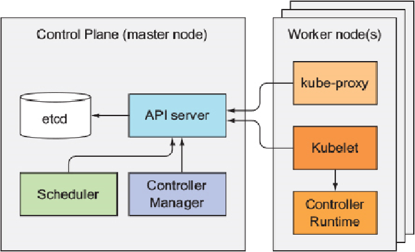
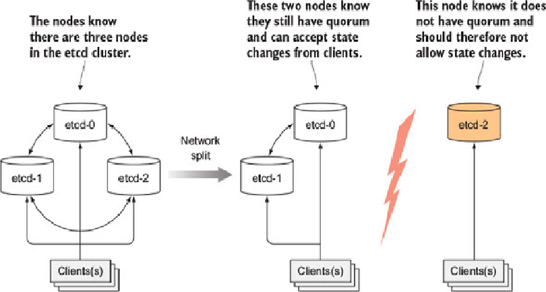
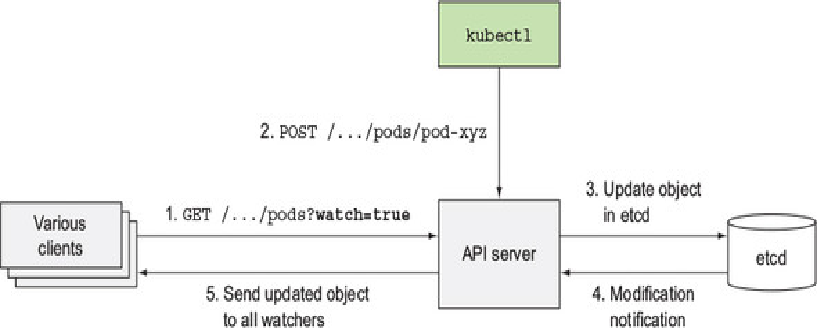
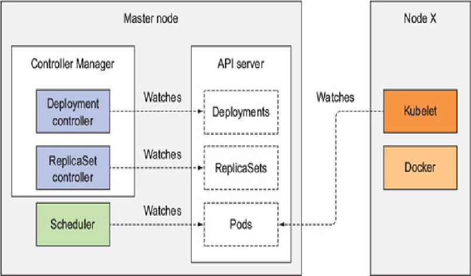
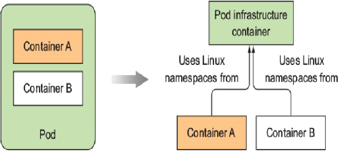
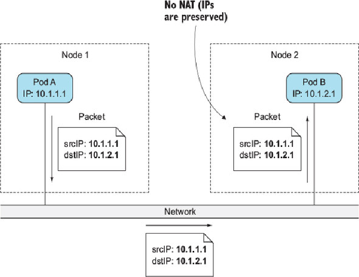
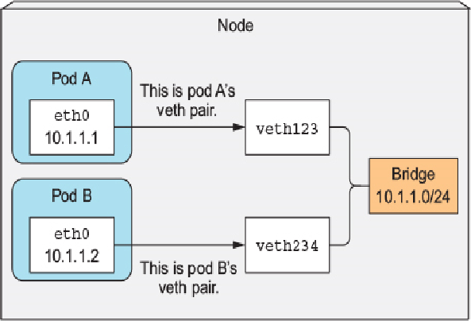
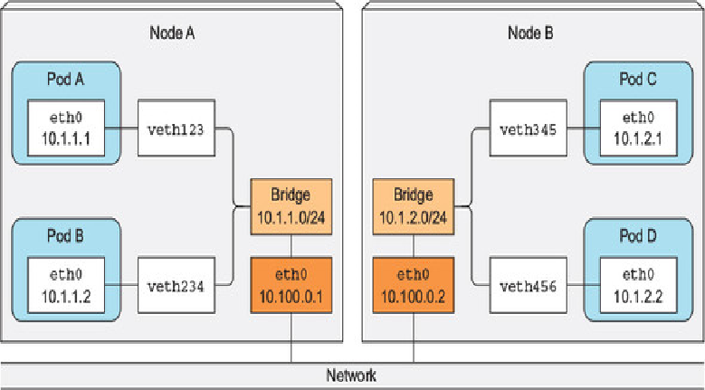
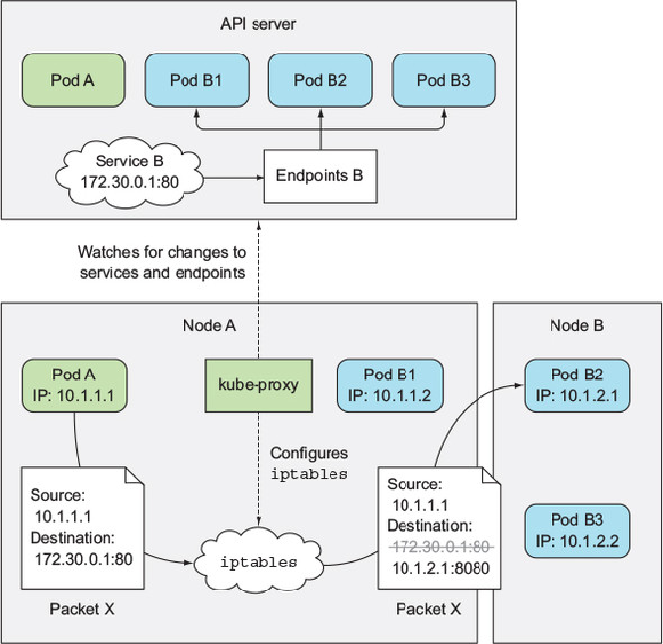
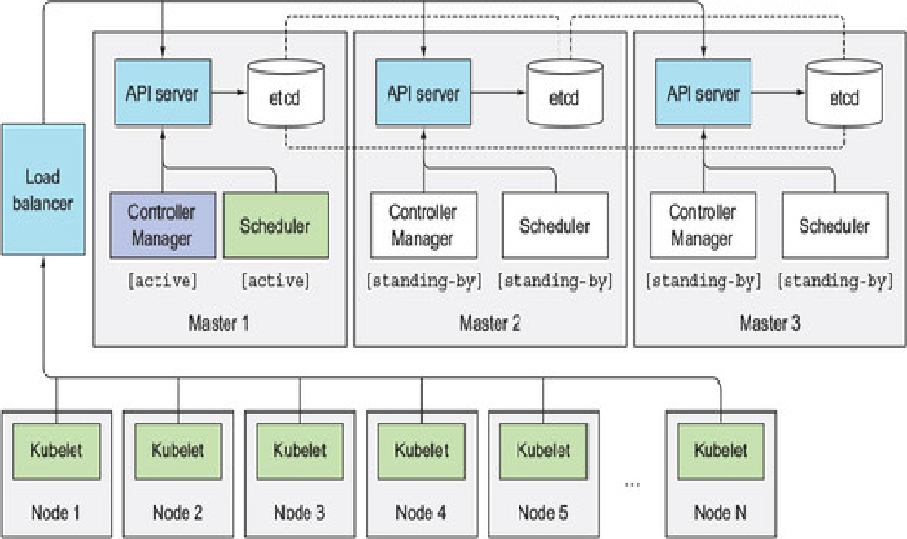

  

Status of the components:  

```
kubectl get componentstatuses

NAME                 STATUS    MESSAGE              ERROR
scheduler            Healthy   ok
controller-manager   Healthy   ok
etcd-0               Healthy   {"health": "true"}
```

__Kubernetes system components communicate only with the API server. They don’t talk to each other directly__. The __API server is the only component that communicates with etcd__.  

__Connections between the API server and the other components are almost always initiated by the components__, as shown in figure. But the API server does connect to the Kubelet when you use kubectl to fetch logs, use kubectl attach to connect to a running container, or use the kubectl port-forward command.  

__The components on the worker nodes__ all need to __run on the same node__, the components of the Control Plane can easily be __split across multiple servers__.  

While __multiple instances of etcd and API server__ can be active at the same time and do perform their jobs in parallel, __only a single instance of the Scheduler and the Controller Manager__ may be active at a given time.  

The __Control Plane components, as well as kube-proxy__, can either be deployed on the __system directly or they can run as pods__. __The Kubelet is the only component that always runs as a regular system component__, and __it’s the Kubelet that then runs all the other components as pods__. __To run the Control Plane components as pods, the Kubelet is also deployed on the master__:  
```
kubectl get po -o custom-columns=POD:metadata.name,NODE:spec.nodeName --sort-by spec.nodeName -n kube-system


POD                              NODE
kube-controller-manager-master   master      
kube-dns-2334855451-37d9k        master      
etcd-master                      master      
kube-apiserver-master            master      
kube-scheduler-master            master      

kube-flannel-ds-tgj9k            node1       
kube-proxy-ny3xm                 node1       
kube-flannel-ds-0eek8            node2       
kube-proxy-sp362                 node2       
kube-flannel-ds-r5yf4            node3       
kube-proxy-og9ac                 node3       
```
We can see which components do run on the master and which ones on the worker nodes. All the Control Plane components are running as pods on the master node. There are three worker nodes, and each one runs the kube-proxy and a Flannel pod, which provides the overlay network for the pods.  

# Controller Plane
## etcd
All the objects you’ve created, ReplicationControllers, Services, Secrets, and so on—need to be stored somewhere in a persistent manner so their manifests survive API server restarts and failures. Kubernetes uses etcd, which is a fast, distributed, and consistent key-value store. Because it’s distributed, __you can run more than one etcd instance to provide both high availability and better performance__.  

The only component that talks to etcd directly is the Kubernetes API server. All other components read and write data to etcd indirectly through the API server. It uses optimistic locking system as well as validation. All other Control Plane components to go through the API server. This way updates to the cluster state are always consistent, because the optimistic locking mechanism is implemented in a single place, so less chance exists.  

### Optimistic Locking
Optimistic concurrency control is a method where instead of locking a piece of data and preventing it from being read or updated while the lock is in place, the piece of data includes a version number. Every time the data is updated, the version number increases. When updating the data, the version number is checked to see if it has increased between the time the client read the data and the time it submits the update. If this happens, the update is rejected and the client must re-read the new data and try to update it again.  

The result is that when two clients try to update the same data entry, only the first one succeeds.  

All Kubernetes resources include a metadata.resourceVersion field, which clients need to pass back to the API server when updating an object. If the version doesn’t match the one stored in etcd, the API server rejects the update.  

### Structure
The keys are stored in etcd as if they were directories (in etcd v2 they are actually stored as directories; not anymore in v3). Each key stores a type of resources:  

```
$ etcdctl ls /registry

/registry/configmaps
/registry/daemonsets
/registry/deployments
/registry/events
/registry/namespaces
/registry/pods

(...)
```
__Note__: ``If you’re using v3 of the etcd API, you can’t use the ls command to see the contents of a directory. Instead, you can list all keys that start with a given prefix with etcdctl get /registry --prefix=true``  

### Clustering
For ensuring high availability, you’ll usually run more than a single instance of etcd. Multiple etcd instances will need to remain consistent. Such a distributed system needs to reach a consensus on what the actual state is. etcd uses the ``RAFT`` consensus algorithm to achieve this. Each node’s state is either what the majority of the nodes agrees is the current state or is one of the previously agreed upon states.  

  

## API Server
The Kubernetes API server is the central component used by all other components and by clients, such as kubectl. Querying and modifying the cluster state over a RESTful API, providing a consistent way of storing objects in etcd. It also handles optimistic locking. One of the API server’s clients is the command-line tool kubectl.  

API server needs to authenticate the client sending the request. Depending on the authentication method, the user can be extracted from the client’s certificate or an HTTP header, such as Authorization. If the request is trying to create, modify, or delete a resource, the request is sent through Admission Control.  

The API server doesn’t do anything else. For example, it doesn’t create pods when you create a ReplicaSet resource and it doesn’t manage the endpoints of a service. That’s what controllers in the Controller Manager do. The API server doesn’t even tell these controllers what to do. All it does is enable those controllers and other components to observe changes to deployed resources. __A Control Plane component can request to be notified when a resource is created, modified, or deleted__. Clients watch for changes by opening an HTTP connection to the API server. Through this connection, the __client will then receive a stream of modifications to the watched objects__.  

  


One of the API server’s clients is the ``kubectl tool``, which also supports watching resources. We can continuously monitor the Pod statuses adding the ``--watch`` tag:  
```
kubectl get pods --watch
```
We can also watch the Pods description:  
```
kubectl get pods -o yaml --watch
```  
___So in summary, the API server doesn’t do anything except store resources in etcd and notify clients about the change.___

## Scheduler
The Scheduler is used to select in which cluster node a podPshould run on. All it does is wait for newly created pods through the API server’s watch mechanism and assign a node to each new pod that doesn’t already have the node set.  

The Scheduler doesn’t instruct the selected node (or the Kubelet running on that node) to run the pod. All the Scheduler does is update the pod definition through the API server. API server then notifies the Kubelet - through the watch mechanism described previously. As soon as the __Kubelet on the target node sees the pod has been scheduled to its node, it creates and runs the pod’s containers__.  

___So in summary, the Scheduler only assigns a node to the pod.___
## Controller Manager
This component is in charge of ensuring that the actual state - stored on the ectd - of the system converges toward the desired state.  

The __single Controller Manager process__ currently combines a __multitude of controllers__ performing various __reconciliation__ tasks. Eventually those controllers will be split up into separate processes, enabling you to replace each one with a custom implementation if necessary. The list of these controllers includes:  
- Replication Manager (a controller for ReplicationController resources)
- ReplicaSet, DaemonSet, and Job controllers
- Deployment controller
- StatefulSet controller
- Node controller
- Service controller
- Endpoints controller
- Namespace controller
- PersistentVolume controller
- Others

They all watch the API server for changes to resources (Deployments, Services, and so on) and perform operations for each change, whether it’s a creation of a new object or an update or deletion of an existing object.  

In general, controllers run a reconciliation loop, which reconciles the actual state with the desired state (specified in the resource’s spec section) and writes the new actual state to the resource’s statussection. Controllers use the watch mechanism to be notified of changes, but because using watches doesn’t guarantee the controller won’t miss an event, they also perform a re-list operation periodically to make sure they haven’t missed anything.  

Controllers never talk to each other directly. They don’t even know any other controllers exist. Each controller connects to the API server and use the watch mechanism.  
# Worker Node
## Kubelet
the Kubelet and the Service Proxy both run on the worker nodes, where the actual pods containers run. Kubelet is the component responsible for everything running on a worker node. Its initial job is to register the node it’s running on by creating a Node resource in the API server. It then needs to continuously monitor the API server for Pods that have been scheduled to the node and start the pod’s containers by telling the configured container runtime (which is Docker, CoreOS’ rkt, or something else) to run a container from a specific container image. The Kubelet then constantly monitors running containers and reports their status, events, and resource consumption to the API server. It runs the container liveness probes, restarting containers when the probes fail. Lastly, it terminates containers when their Pod is deleted from the API server and notifies the server that the pod has terminated.    
## Kubernetes Service Proxy
Every worker node also runs the kube-proxy, whose purpose is to make sure clients can connect to the services you define through the Kubernetes API.  

The initial implementation of the kube-proxy was the userspace proxy. It used an actual server process to accept connections and proxy them to the pods. The current, much better performing implementation only uses iptables rules to redirect packets to a randomly selected backend pod without passing them through an actual proxy server.  

## Kubernetes add-ons
Are deployed as pods by submitting YAML manifests to the API server.

# Example of a deployment
We are going to use a Deployment resource to understand all the events that will happen untill the Pods, RC, services are running.  


The controllers, the Scheduler, and the Kubelet are __watching the API server for changes to their respective resource types__.  

  

The YAML file containing the Deployment manifest is submitted to Kubernetes through kubectl. kubectl sends the manifest to the Kubernetes API server in an HTTP POST request. The API server validates the Deployment specification, stores it in etcd, and returns a response to kubectl.  

All API server clients watching the list of Deployments through the API server’s watch mechanism are notified of the newly created Deployment resource immediately after it’s created. One of those clients is the Deployment controller. A Deployment is backed by one or more ReplicaSets, which then create the actual pods. As a new Deployment object is detected by the Deployment controller, it creates a ReplicaSet for the current specification of the Deployment. This involves creating a new ReplicaSet resource through the Kubernetes API. The Deployment controller doesn’t deal with individual pods at all.  

The newly created ReplicaSet is then picked up by the ReplicaSet controller, which watches for creations, modifications, and deletions of ReplicaSet resources in the API server. The controller takes into consideration the replica count and pod selector defined in the ReplicaSet and verifies whether enough existing Pods match the selector. The controller then creates the Pod resources based on the pod template in the ReplicaSet.  

These newly created Pods are now stored in etcd, but they each still lack one important thing—they don’t have an associated node yet. Their nodeName attribute isn’t set. The Scheduler watches for Pods like this, and when it encounters one, chooses the best node for the Pod and assigns the Pod to the node. The Pod’s definition now includes the name of the node it should be running on.  

Everything so far has been happening in the Kubernetes Control Plane. The worker nodes haven’t done anything up to this point. The pod’s containers haven’t been started yet. The images for the pod’s containers haven’t even been downloaded yet.__The Kubelet, watching for changes to Pods on the API server__, sees a new Pod scheduled to its node, so it inspects the Pod definition and __instructs Docker, or whatever container runtime__ it’s using, to __start the pod’s__ containers.  

## Events
Both the Control Plane components and the Kubelet emit events to the API server as they perform these actions. They do this by creating Event resources, which are like any other Kubernetes resource. You can also retrieve events directly with kubectl get events. Using kubectl get to inspect events is painful, because they’re not shown in proper temporal order. If an event occurs multiple times, the event is displayed only once, showing when it was first seen, when it was last seen, and the number of times it occurred. Watching events with the ``--watch`` option is much easier on the eyes:
```
kubectl get events --watch
```
## Infrastructure Container
When a Pod is created, an infrastructure container is created. The role of this container is to hold all the containers of a pod together, with the same network and Linux namespaces:  


# Inter-Pod Networking
Each pod gets its own unique IP address and can communicate with all other pods through a flat, NAT-less network. The network is set up by the system administrator or by a Container Network Interface (CNI) plugin, not by Kubernetes itself.  

Kubernetes doesn’t require you to use a specific networking technology, but it does mandate that the pods (or to be more precise, their containers) can communicate with each other, regardless if they’re running on the same worker node or not. The network the pods use to communicate must be such that the IP address a pod sees as its own is the exact same address that all other pods see as the IP address of the pod in question. When pod A connects to (sends a network packet to) pod B, the source IP pod B sees must be the same IP that pod A sees as its own. There should be no network address translation (NAT) performed in between.  

  

The requirement for NAT-less communication between pods also extends to pod-to-node and node-to-pod communication. But when a pod communicates with services out on the internet, the source IP of the packets the pod sends does need to be changed, because the pod’s IP is private. The source IP of outbound packets is changed to the host worker node’s IP address. Building a proper Kubernetes cluster involves setting up the networking according to these requirements.  

A pod’s network interface is thus whatever is set up in the infrastructure container. Before the infrastructure container is started, a __virtual Ethernet interface pair (veth pair)__ is created for the container. __One interface of the pair__ remains in the __host’s - node - namespace__ - listed as __vethXXX__ when you run ``ifconfig`` on the node -, whereas __the other__ is moved into the __container’s network namespace__ and renamed __eth0__. The two virtual interfaces are like two ends of a pipe (or like two network devices connected by an Ethernet cable)—what goes in on one side comes out on the other, and vice-versa.  

The interface in the __host’s network namespace__ is __attached__ to a network bridge that the __container runtime__ is configured to use. The __eth0 interfac__e in the container is __assigned an IP address from the bridge’s address range__. Anything that an application running inside the container sends to the eth0 network interface (the one in the container’s namespace), comes out at the other veth interface in the host’s namespace and is sent to the bridge. This means it can be received by any network interface that’s connected to the bridge.  



If pod A sends a network packet to pod B, the packet first goes through pod A’s veth pair to the bridge and then through pod B’s veth pair. All containers on a node are connected to the same bridge, which means they can all communicate with each other. But to enable communication between containers running on different nodes, the bridges on those nodes need to be connected somehow.  

## Enabling communication between pods on different nodes
We have to connect bridges on different nodes. This can be done with overlay or underlay networks or by regular layer 3 routing, which we’ll look at next.  

Pod IP addresses must be unique across the whole cluster, so the bridges across the nodes must use non-overlapping address ranges to prevent pods on different nodes from getting the same IP. For example, here on node A we are using the 10.1.1.0/24 IP range and on the bridge in node B we are using 10.1.2.0/24. This ensures that there is no IP address conflicts.  

To enable communication between pods across two nodes with plain layer 3 networking, the node’s physical network interface needs to be connected to the bridge as well. Routing tables on node A need to be configured so all packets destined for 10.1.2.0/24 are routed to node B, whereas node B’s routing tables need to be configured so packets sent to 10.1.1.0/24 are routed to node A.  



When a packet is sent by a container on one of the nodes to a container on the other node, the packet first goes through the veth pair, then through the bridge to the node’s physical adapter, then over the wire to the other node’s physical adapter, through the other node’s bridge, and finally through the veth pair of the destination container. This works only when nodes are __connected to the same network switch__, without any routers in between; otherwise those routers would drop the packets because they refer to pod IPs, which are private. Sure, the routers in between could be configured to route packets between the nodes, but this becomes increasingly difficult and error-prone as the number of routers between the nodes increases. Because of this, it’s easier to use a __Software Defined Network (SDN)__, which __makes the nodes appear as though they’re connected to the same network switch__.  

## Services
When a service is created in the API server, the virtual IP address is assigned to it immediately. the API server notifies all kube-proxy agents running on the worker nodes that a new Service has been created. Then, each kube-proxy makes that service addressable on the node it’s running on. It does this by setting up a few iptables rules, which make sure each packet destined for the service IP/port pair is intercepted and its destination address modified, so the packet is redirected to one of the pods backing the service.  

Besides watching the API server for changes to Services, kube-proxy also watches for changes to Endpoints objects. The packet’s destination is initially set to the IP and port of the Service (in the example, the Service is at 172.30.0.1:80). Before being sent to the network, the packet is first handled by node A’s kernel according to the iptables rules set up on the node:  


# High Availability
For running services without interruption it’s not only the apps that need to be up all the time, but also the Kubernetes Control Plane components.  

When running apps in Kubernetes, the various controllers make sure your app keeps running smoothly and at the specified scale even when nodes fail. To ensure your app is highly available, you only need to run them through a Deployment resource and configure an appropriate number of replicas.  



etcd was designed as a distributed system, one of its key features is the ability to run multiple etcd instances, so making it highly available is no big deal. All you need to do is run it on an appropriate number of machines (three, five, or seven, as explained earlier in the chapter) and make them aware of each other. etcd will replicate data across all its instances, so a failure of one of the nodes when running a three-machine cluster will still allow the cluster to accept both read and write operations. To increase the fault tolerance to more than a single node, you need to run five or seven etcd nodes, which would allow the cluster to handle two or three node failures, respectively.  

Making the API server highly available is even simpler. Because the API server is (almost completely) stateless (all the data is stored in etcd, but the API server does cache it), you can run as many API servers as you need, and they don’t need to be aware of each other at all. Usually, one API server is collocated with every etcd instance. By doing this, the etcd instances don’t need any kind of load balancer in front of them, because every API server instance only talks to the local etcd instance. The API servers, on the other hand, do need to be fronted by a load balancer, so clients (kubectl, but also the Controller Manager, Scheduler, and all the Kubelets) always connect only to the healthy API server instances.  

Compared to the API server, where multiple replicas can run simultaneously, running multiple instances of the Controller Manager or the Scheduler isn’t as simple. When running multiple instances of these components, only one instance may be active at any given time. Each individual component will only be active when it’s the elected leader. The Controller Manager and Scheduler can run collocated with the API server and etcd, or they can run on separate machines. When collocated, they can talk to the local API server directly; otherwise they connect to the API servers through the load balancer. These components don’t need to talk to each other directly to elect a leader. The leader election mechanism works purely by creating a resource in the API server. And it’s not even a special kind of resource—the Endpoints resource is used to achieve this. All instances of the Scheduler try to create (and later update) an Endpoints resource called kube-scheduler. 
